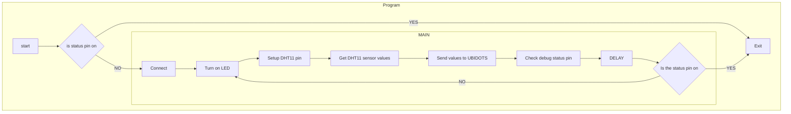

# Tutorial on how to build a temperature and humidity sensor
Felix Lidö - fl223gf

The objective of this project is to measure temperature and humitdity from a sensor. The data is then sent to ubidots for analaysis

**Time**: around one hour

## Objective  
I had been sleeping poorly due to the swedish summer heat. To combat this I created a small IOT project to track the temperature in my bedroom. The plan was to use this data and see when and why the bedroom got to its warmest point, was it due to computer devices emitting a lot of heat or the general temperature outside? Being a student meaning that I didn't have the biggest disposable icome to fix say my PCs heating issue I investigated to see if it was something else cheaper that needed a fix first. While project didn't include data from my PC it really should have so I wouldn't have to guess at the cause

## Material
#####  Materials required for build:
| Material | Price (sek) | Link | Description|
|:------ |:-----------: | :-------:|:-------|
| Rasberry Pi Pico W| 98 | [Electrokit](https://www.electrokit.com/produkt/raspberry-pi-pico-w/)|The brains of this operation. This is where the code is executed from. The Pico Ws comes with WIFI and other wireless communcation capabilities
| DHT11 Sensor| 49 | [Electrokit](https://www.electrokit.com/produkt/digital-temperatur-och-fuktsensor-dht11/) | Used to collect the temperature and humidity data
| Jumper wire | 29|[Electrokit](https://www.electrokit.com/produkt/labbsladd-20-pin-15cm-hane-hane/)| Tranfer data and power/ground
|220 $\Omega$ Resistor|3|[Electrokit](https://www.electrokit.com/en/product/resistor-1w-5-220ohm-220r/)| Stops the DHT11 from getting overheated
|Micro-USB cable|119.90|[Kjell & Company](https://www.kjell.com/se/produkter/kablar-kontakter/usb-kablar/micro-usb-kabel-1-m-p68687)| Used to put code on and power the Pico

Total cost: sek
##### Extra material used for debugging: 
| Material | Price (sek) | Link |Description|
|:------ |:-----------: | :-------:|:-------|
|Push button PCB 0.8 mm black|5.50|[Electrokit](https://www.electrokit.com/en/product/push-button-pcb-0-8-mm-black/)| Used for exiting the main code loop so that applications like VScode can come in and talk to the Pico

## Computer setup
For this tutorial the Thonny editor will be used for two main reasons. It can be used almost directly out of the box with the Rasberry Pi Pico with minimal setup required and it has a built in shell to directly communicate with the Pico

Step by step for Windows 11
1. Download and install the [Thonny](https://thonny.org/) editor
2. Download the Raspberry Pi Pico W firmware at [https://rpf.io/pico-w-firmware](https://rpf.io/pico-w-firmware) 
3. Hold down the BOOTSEL button on the Raspberry pi and connect it to your computer
	![[^1]](https://projects-static.raspberrypi.org/projects/get-started-pico-w/102a04c1d3fc3df01dc1b2505bf353f8cbc0bc1a/en/images/bootsel.png) 
4. The file explorer should now popup with a almost empty directory. Put the firmware (.uf2) file in there and it should automatically close
5. Open up Thonny
6. In the lower right corner there should be a button with the text `Local Python 3 * Thonny's Python`. Click on it and change it to `MicroPython (Raspberry Pi Pico) * Board @ COMx` or if that's not an option click on `Configure interpreter...` and select `Raspberry Pi Pico` as interpreter and `< Try to detect port automatically >` when selecting Port or WebREPL
7. Now create a new file called `boot.py` and save it to Pico. The boot file will automatically start on boot and if there if is a `main.py` file on the pico it will execute when boot is finished.

## Putting everything together
The following is the circuit diagram and a real world application of the circuit diagram


## Platfrom
The platform we are going to use for storing, displaying and graphing the data is called [Ubidots](https://ubidots.com/). The way we are going to communicate with ubidots is through the buildt-in pico network and urequest libraries. As we will se late in the code section we are going to use HTTP request sent to the ubidots API to communicate, this is also the reason why we use ubisoft, as we can just use the built-in libraries to send data to their platform 

## The code
The program is defined according to this flowchart

You have one main program that loops until it get interrupted by the status pin (#15 in the circuit diagram) reciving a signal. The status pin is there so programs like Vscode and Thonny can come in and edit the code on the Pico if their own tools can't get a communication over the USB.

So how what does the program accually look like?[^1] Well we start off by defining a couple of global constants. Notice! Due to safety reasons some of the constats are left blank, this is for each user to fill out as needed.  
[^1]: For the boot program in it's entierly see: [boot.py] (https://github.com/Quipcore/Temperature-Humidity-Measurer/blob/main/boot.py)

``` python
from machine import Pin
TOKEN = "" #Put your TOKEN here
DEVICE_LABEL = "picowboard" # Assign the device label desire to be send
TEMP_LABEL = "temp" # Assign the temperature label desire to be send
HUMIDITY_LABEL = "humidity" # Assign the humidity label desire to be send
WIFI_SSID = "" # Assign your the SSID of your network
WIFI_PASS = "" # Assign your the password of your network
DELAY = 5  # Delay in seconds
LED_PIN = Pin("LED", Pin.OUT)
```

This is main method and it follows the flowchart above. Connect to wifi, take temperature and humidity measurements, and then send it ubidots. 
```python
import dht11 as dht
from time import sleep_ms

def main():
    connect()
    bad_value = -10000
    while check_status_pin():
        LED_PIN.on() #Signal succesfull connection and status
        dht11_sensor = dht.DHT11(Pin(27))
        temp = bad_value
        humidity = bad_value
        try:
            temp = dht11_sensor.temperature
            humidity = dht11_sensor.humidity
        except:
            pass
        
        if temp != bad_value and humidity != bad_value:
            returnValue = sendData(DEVICE_LABEL, temp, humidity)
        else:
            print("Failed to get signal")
            LED_PIN.off()
            
        sleep_ms(DELAY*1000)
```

This connect method is more or less borrowed directly from the raspberry pi documentation
```python
import network
from time import sleep

#Connect to WIFI
def connect():
    wlan = network.WLAN(network.STA_IF)         # Put modem on Station mode
    if not wlan.isconnected():                  # Check if already connected
        print('connecting to network...')
        wlan.active(True)                       # Activate network interface
        # set power mode to get WiFi power-saving off (if needed)
        wlan.config(pm = 0xa11140)
        wlan.connect(WIFI_SSID, WIFI_PASS)  # Your WiFi Credential
        print('Waiting for connection...', end='')
        # Check if it is connected otherwise wait
        while not wlan.isconnected() and wlan.status() >= 0:
            print('.', end='')
            sleep(1)
    # Print the IP assigned by router
    ip = wlan.ifconfig()[0]
    print('\nConnected on {}'.format(ip))
    return ip
```

The build_json and sendData get the values from the DHT11 sensor and then builds the packet that is then sent with a HTTP request to ubidots where the data is stored and visualized
```python
import network
import urequests as requests

# Builds the json to send the request
def build_json(temp_value, humidity_value):
    try:
        data = {TEMP_LABEL: {"value": temp_value}, HUMIDITY_LABEL: {"value": humidity_value}}
        return data
    except:
        return None

#Send data to ubidots API
def sendData(device, temp_value, humidity_value):
    try:
        url = "https://industrial.api.ubidots.com/"
        url = url + "api/v1.6/devices/" + device
        headers = {"X-Auth-Token": TOKEN, "Content-Type": "application/json"}
        data = build_json(temp_value, humidity_value)
        if data is not None:
            print(data)
            req = requests.post(url=url, headers=headers, json=data)
            return req.json()
        else:
           pass
    except:
        pass
```

**Required libraries**:
[DHT11](https://github.com/iot-lnu/applied-iot/blob/master/1DV027/DHT11-pico-w/dht.py)


## Transmitting the data/Connectivity
As per the ubidots [api documentation](https://docs.ubidots.com/v1.6/reference/http) the HTTP request to post is the following 
```
POST {PATH} HTTP/1.1<CR><LN> 
Host: {HOST}<CR><LN> 
User-Agent: {USER_AGENT}<CR><LN> 
X-Auth-Token: {TOKEN}<CR><LN> 
Content-Type: application/json<CR><LN> 
Content-Length: {PAYLOAD_LENGTH}<CR><LN><CR><LN> {PAYLOAD} <CR><LN>
``` 
The program the takes in the relevant information and send the following to ubidots

```
POST api/v1.6/devices/picowboard HTTP/1.1<CR><LN> 
Host: industrial.api.ubidots.com<CR><LN> 
X-Auth-Token: TOKEN <CR><LN> 
Content-Type: application/json<CR><LN> 
Content-Length: 54<CR><LN><CR><LN> 
{"temp": {"value": temp_value}, "humidity": {"value": humidity_value}} <CR><LN>
``` 
> Notice the disapperance of `User-Agent: {USER_AGENT} <CR><LN>`. This is because  this header is optional

This is then sent as a POST request to ubidots.
In ubidots there is a dashboard that visualize the data from the device as specified by the authentication token. In the ubidots the are two labels "temp" and "humidity" connected to the pico device/token this is then shown as a graph in the dashboard

## Presenting the data
In the ubidots the are two labels "temp" and "humidity" connected to the pico device/token this is then shown as a graph in the dashboard. Below is the data collected between Jun 28-Jul 04


The ubidots api can handle 5 requests/sec but mostly due the fact at the scale above you can't see 5 data points every second the pico is set to send once every 5 second, but if it fails to do so for some reason it won't really matter if it takes 10-15 seconds between requests going it's still going to have the right shape in the visualization. 
## Finalizing the design
